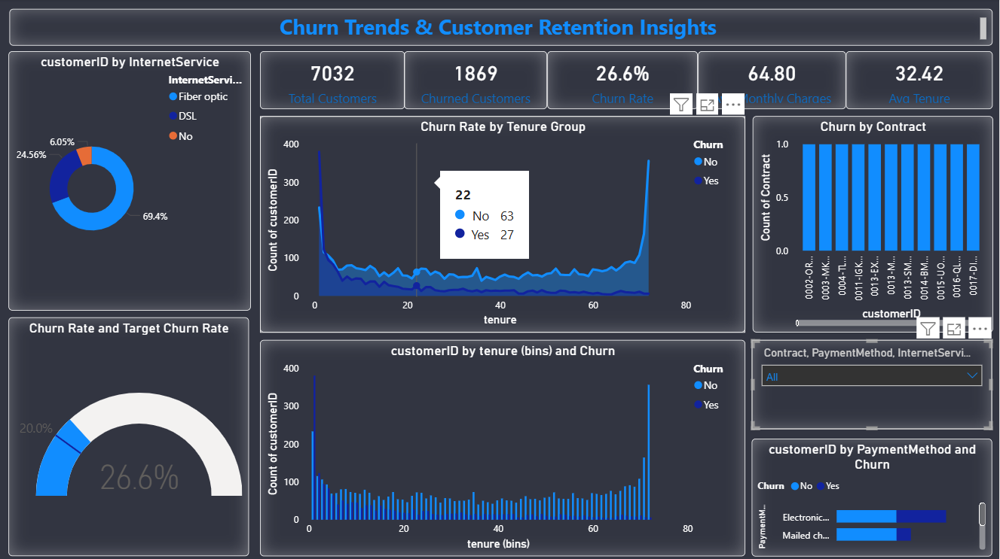

# Customer Churn Analysis

## Executive Summary
This project analyzes customer churn data to identify patterns and factors that influence customer attrition. Using Python for data analysis and Power BI for visualization, the project uncovers key drivers of churn and provides actionable business recommendations to improve customer retention.

## Business Problem
Customer churn is a major concern for subscription-based businesses. Losing customers reduces revenue and increases acquisition costs.

This analysis aims to answer:
- What is the overall churn rate?
- Which customer groups are more likely to churn?
- What factors contribute most to customer attrition?

## Tools & Technologies
- **Python**
  - Pandas
  - NumPy
  - Matplotlib
  - Seaborn
- **Power BI**
- Jupyter Notebook
- GitHub

## Dataset
- Telecom customer churn dataset
- Contains customer demographics, service details, and churn status

  **Key Features:**
- Gender
- Senior Citizen
- Contract Type
- Tenure
- Monthly Charges
- Total Charges
- Payment Method
- Churn (Yes/No)

## Project Workflow
1. Data loading and inspection
2. Data cleaning and type conversion
3. Handling missing values
4. Exploratory data analysis (EDA)
5. Categorical and numerical analysis
6. Churn rate calculation
7. Dashboard creation in Power BI

## Key Insights
- Customers with **month-to-month contracts** have the highest churn rate.
- **Short-tenure customers** are more likely to leave.
- Higher **monthly charges** are associated with increased churn.
- Customers using **electronic check payments** show higher churn compared to other methods.
- Long-term contracts significantly reduce churn risk.

## Dashboard Preview

## Dashboard Features
The Power BI dashboard includes:
- Overall churn rate KPI
- Churn by contract type
- Churn by payment method
- Churn by tenure group
- Monthly charges vs churn
- Customer distribution visuals

## Project Structure
Customer-Churn-Analysis
│
├── data
│ └── churn_data.csv
│
├── notebook
│ └── churn_analysis.ipynb
│
├── dashboard
│ └── churn_dashboard.pbix
│
└── README.md

## How to Run the Project
1. Clone the repository:
   git clone https://github.com/pujithavaka99/Customer-Churn-Analysis.git

2. Open the notebook:
notebook/churn_analysis.ipynb

3. Run all cells to reproduce the analysis.
4. Open the Power BI dashboard:
   dashboard/churn_dashboard.pbix

## Skills Demonstrated
- Data cleaning and preprocessing
- Exploratory data analysis
- Churn rate calculation
- Data visualization
- Dashboard design
- Business insight generation

## Business Recommendations
- Encourage customers to switch to **long-term contracts**.
- Offer **loyalty discounts** to short-tenure customers.
- Improve value perception for high monthly charge plans.
- Provide incentives for customers using high-churn payment methods.

  ## Author
**Pujitha Vaka**  
Aspiring Data Analyst  

- GitHub: https://github.com/pujithavaka99  
- LinkedIn: https://www.linkedin.com/in/pujithavaka99  

